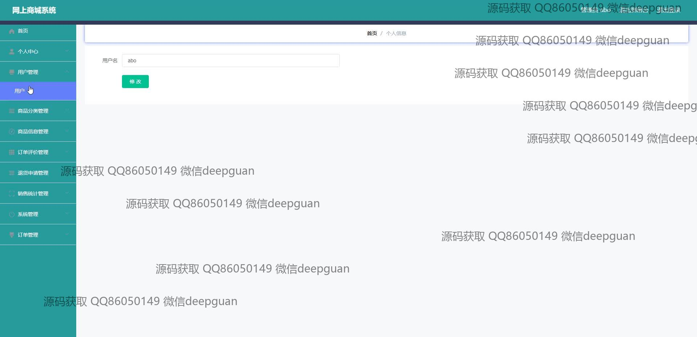

<h1 align="center">网上商城系统+vue</h1>

## 简介
网上商城系统：角色分为管理员、用户；功能涵盖用户管理、商品分类管理、订单管理、商品信息管理、订单评价管理、退货申请管理，提供购物车和在线客服等功能模块，界面简洁高效，支持响应式布局。    --计算机毕业设计源码；毕设源码；java毕业设计源码

## 联系方式

<h3 align="center">获取完整代码与数据库文件 + 微信：deepguan QQ: 86050149 QQ群: 783742310</h3>

<h3 align="center">可帮忙远程部署 包运行成功！提供远程部署、修改代码、设计文档指导、代码讲解等服务！</h3>

## 功能介绍（完整见运行截图）
管理员：基本功能包括登录、注册和退出。导航栏提供首页、个人中心和后台管理入口，支持商品分类、用户管理、订单管理和商品信息管理。系统允许对商品进行详细编辑和对用户进行审核管理，支持订单审核和退货申请管理。管理员可以查看统计报表，以分析商品销售数据，确保有效的商城信息管理。

用户：基本功能涵盖登录、注册和退出操作。首页提供商品展示及推荐功能，包括查看商品详细信息、搜索商品及商品分类浏览。用户可以添加商品至购物车并进行结算，还可模拟在线付款。用户中心支持查看个人信息、订单查询、地址管理及收藏商品。同时，系统允许用户上传产品评价及管理订单评价，提供良好的购物和反馈体验。

## 运行截图

本代码来源于网络,仅供学习参考使用!

